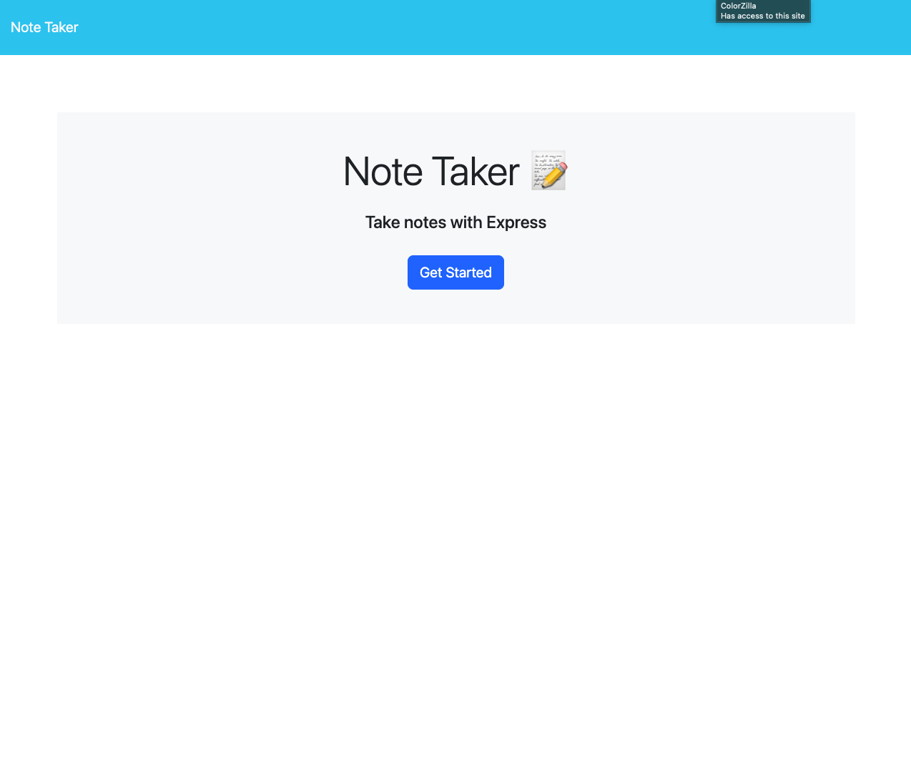
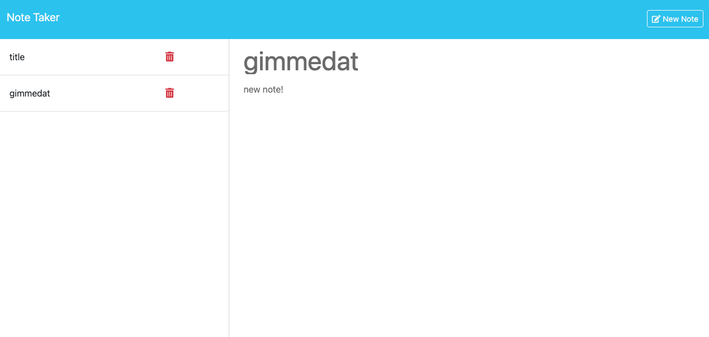

# Note Taker

## Description

This project allows the user to enter notes with a title and note text. It also contains a database of existing notes that render when the page loads. 

Github Repo: https://github.com/whitbreezy/note-taker

App Deployed via Heroku:

## Installation

Visit my github repo linked above and clone or fork from my code. 

## Usage

Provide instructions and examples for use. Include screenshots as needed.

To add a screenshot, create an `assets/images` folder in your repository and upload your screenshot to it. Then, using the relative filepath, add it to your README using the following syntax:

## Credits

I used my class notes from my coding bootcamp as a reference.

## License

See repo for license info

